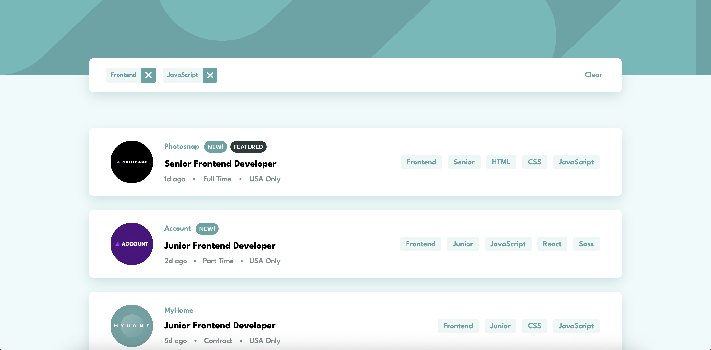

# Frontend Mentor - Job listings with filtering solution

This is a solution to the [Job listings with filtering challenge on Frontend Mentor](https://www.frontendmentor.io/challenges/job-listings-with-filtering-ivstIPCt). Frontend Mentor challenges help you improve your coding skills by building realistic projects. 

## Table of contents

- [Overview](#overview)
  - [The challenge](#the-challenge)
  - [Screenshot](#screenshot)
  - [Links](#links)
- [My process](#my-process)
  - [Built with](#built-with)
  - [What I learned](#what-i-learned)
  - [Continued development](#continued-development)
  - [Useful resources](#useful-resources)
- [Author](#author)
- [Acknowledgments](#acknowledgments)

**Note: Delete this note and update the table of contents based on what sections you keep.**

## Overview

### The challenge

Users should be able to:

- View the optimal layout for the site depending on their device's screen size
- See hover states for all interactive elements on the page
- Filter job listings based on the categories

### Screenshot

### Links

- Solution URL: [Add solution URL here](https://your-solution-url.com)
- Live Site URL: [Add live site URL here](https://your-live-site-url.com)

## My process
I started by building the page using HTML and then styled a static page with CSS. Then I used JS to generate HTML from data.json and add some functionality in it. Later I used media query for responsive design on smaller screens (around 768px).

### Built with

- Semantic HTML5 markup
- CSS custom properties
- Flexbox
- JS

### What I learned

- Used fetch() to load JSON data dynamically
- Handling filtering logic and state

### Continued development

I mainly want to work upon some backend as well in my next project and also figure out the use of APIs

### Useful resources

- https://supersimpledev.github.io/references/html-css-reference.pdf - This reference pdf helped me find out syntax of functions I didn't clearly remembered

## Author

- Rishav Kumar (2Y at IIT Roorkee)